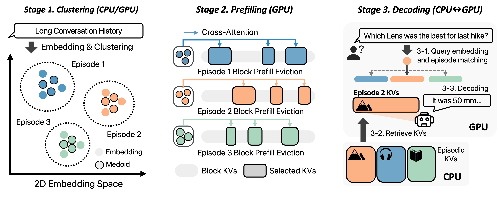

# EpiCache: Episodic KV Cache Management for long conversational Question Answering

This repository contains the code to reproduce results for the paper **EpiCache**.  
Paper: https://arxiv.org/abs/2509.17396



This code is developed based on KVzip repo (MIT License).  
https://github.com/snu-mllab/KVzip
and
https://github.com/FFY0/AdaKV

## Installation
The code here has been verified to work with the combination of CUDA 12.1, Python 3.10, and PyTorch 2.3.
```bash
pip install -r requirements.txt
pip install flash-attn==2.7.4.post1 --no-build-isolation
make i
```

## Evaluation
```bash
# For EpiCache
bash scripts/run_epicache_qwen.sh ${GPU_NUM} ${SCALE} ${LEVEL} ${KV_BUDGET} ${CHUNK_SIZE} ${DO_ALLOC} ${DATA} ${TARGET_LENGTH}
bash scripts/run_llama_epicache.sh ${GPU_NUM} ${SCALE} ${LEVEL} ${KV_BUDGET} ${CHUNK_SIZE} ${DO_ALLOC} ${DATA} ${TARGET_LENGTH}

# For Baseline (KVzip, KeyDiff, SnapKV, InfiniPot)
bash scripts/run_qwen_baseline.sh ${GPU_NUM} ${SCALE} ${LEVEL} ${KV_BUDGET} ${CHUNK_SIZE} ${METHOD} ${DATA} ${TARGET_LENGTH}
bash scripts/run_llama_baseline.sh ${GPU_NUM} ${SCALE} ${LEVEL} ${KV_BUDGET} ${CHUNK_SIZE} ${METHOD} ${DATA} ${TARGET_LENGTH}

# GPT Score for Realtalk
python run_gpt_eval.py --directory ${RESULT_DIR}
```

### Arguments

* **GPU\_NUM**: GPU index
* **SCALE**: Model scale (`3B`, `7B`, `8B`)
* **LEVEL**: KV cache selection strategy

  * `pair`: non-uniform selection (head-wise)
  * `pair-uniform`: uniform per head
  * Example (KV budget = 16K across 4 heads): `pair`: \[2K, 6K, 3K, 5K], `pair-uniform`: \[4K, 4K, 4K, 4K]
* **KV\_BUDGET**: KV cache budget (\$M\$)
* **CHUNK\_SIZE**: Block size used in block prefill eviction
* **EMBEDDING**: Embedding model for clustering & query matching
  * `qwen`: Qwen-0.6B (higher accuracy)
  * `sentence`: MiniLM-v2-L6 (faster, recommended)
  * `llm`: Target LLM’s internal embedding layer (lower accuracy)
* **POWER**: Sharpness parameter (\$\alpha\$) for layer-wise allocation
* **DATA**: Dataset (`locomo`, `realtalk`, `longmemeval`)
* **DO\_ALLOC**: Toggle sensitivity-aware allocation (`False` = off, `True` = on)
* **TARGET\_LENGTH**: Target context length for LongMemEval
* **METHOD**: Baseline compression method (`kvzip`, `keydiff`, `infinipot`, `snapkv`)

### Additional Evaluation Options

For convenience, we provide two alternative entry points:

* **`run_epicache.py`**
  Full EpiCache pipeline:
  Clustering → query matching per question → KV cache provision → decoding.

* **`run_epicache_eval.py`**
  Evaluation-optimized:
  Pre-embeds all benchmark questions and matches them to episodes.
  Evaluation is then performed cluster-wise based on matched questions.

## Dataset

### LongMemEval

Please download the compressed raw data from [LongMemEval Repo](https://github.com/xiaowu0162/LongMemEval) and uncompress it under `data/longmemeval/custom_history/`.
The released data consists of the following parts:

* **1\_attr\_bg/data\_1\_attr\_bg.json**: user attributes and backgrounds
* **2\_questions/**: questions, answers, evidence statements, and evidence sessions
* **5\_filler\_sess/data\_5\_filler\_sess.json**: filler sessions from ShareGPT and UltraChat
* **6\_session\_cache/data\_6\_session\_cache.json**: simulated user sessions based on extracted background facts

After downloading, you can generate custom long conversations using:

```bash
# Example: generate 50 user–LLM conversations with ~100K tokens
python data/longmemeval/create_custom_dataset.py \
  --num_conversations 50 \
  --min_tokens 95000 \
  --max_tokens 100000 \
  --output_file custom_lme_100000_50.json

python data/longmemeval/convert_longmemeval.py \
   --input_path custom_lme_100000_50.json \
   --output_path custom_lme_100000_50.pt
```

This script stacks evidence sessions until the target length is reached, producing coherent user–LLM conversations with corresponding QA pairs for evaluation.

### LoCoMo & Realtalk

[LoCoMo](https://github.com/snap-research/locomo/blob/main/data/locomo10.json) and [Realtalk](https://github.com/danny911kr/REALTALK/tree/main/data) need to be downloaded and converted into pre-processed data for evaluation:

```bash
# LoCoMo
python data/locomo/convert_locomo.py

# Realtalk
python data/realtalk/convert_realtalk.py
```

These scripts will generate:

* `data/locomo_preprocessed.pt`
* `data/realtalk_preprocessed.pt`

Both files are ready to use for evaluation.
If you wish to modify the instructions appended to each subtask, edit the corresponding `convert_*.py` script.

### BookSum (Layer-wise Sensitivity Profiling)

Please download the BookSum dataset by following the instructions from the [DuoAttention Repository](https://github.com/mit-han-lab/duo-attention), and place it under `data/booksum/`.

You can then preprocess the dataset and run layer-wise profiling as follows:

```bash
# BookSum preprocessing (default input length = 16K)
python data/booksum/preproc_booksum.py \
  --model_path ${MODEL} \
  --max_length ${MAX_LENGTH}

# Layer-wise sensitivity profiling (use preprocessed file)
python data/layer_scores/layer_profile.py \
  --model_path ${MODEL} \
  --input_file ${BOOKSUM_PRE}
```

This will generate a JSON file containing per-layer sensitivity scores.
Set the generated file as `SCORE_PATH` when running `scripts/run_epicache_*` to enable sensitivity-aware allocation.

## Citation

If you find our work useful, please cite:

```bibtex
@misc{epicache,
title = {EpiCache: Episodic KV Cache Management for Long Conversational Question Answering},
author = {Minsoo Kim and Arnav Kundu and Han-Byul Kim and Richa Dixit and Minsik Cho},
year = {2025},
URL = {https://arxiv.org/abs/2509.17396}
}
```

For questions or feedback, please feel free to:

* Open an issue in this repository, or
* Reach out via email: **[minsoo2333@hanyang.ac.kr](mailto:minsoo2333@hanyang.ac.kr)**
